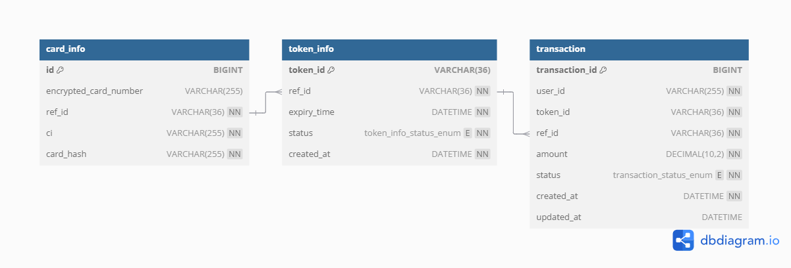

# [BLUEWALNUT] 토근기반 결제 시스템 개발

토근기반 결제 시스템 개발

- 1회용 토큰 기반 결제시스템을 구축하려 한다.
- 전체 과업은 결제 카드 등록 단계와 실제 결제 단계로 나뉜다.
- 결제 카드 등록 단계에서는, 고객의 신용카드 정보를 받아 별도 시스템(토큰 발급 시스템)에 등록하고, 그 결과로 카드 참조값(REF_ID)을 받아온다
- 실제 결제 단계에서는, 해당 카드 참조값을 이용해 토큰 발급 시스템에 1회용 토큰을 발급 받은 후, 해당 토큰으로 결제 승인 시스템과 통신해 결제를 처리한다.
- 이때, 결제 승인 시스템에서는 토큰 발급 시스템에 질의해 토큰의 유효성을 체크한 후 결제 승인을 최종적으로 마무리하는 과정을 거친다.

#### 업무 요구사항

1. 사용자의 CI는 이미 습득을 했으며 사용자 식별키로 CI를 사용한다.
2. 카드정보는 결제시스템에서 볼 수 없으며 암호화하여 토큰발급 시스템에 저장한다.
3. 결제단계에서는 카드정보 대신 카드 참조값으로 결제를 진행해야 한다.
4. 모든 거래는 rest API 기반으로 설계한다.
5. 제시된 내용외에 프로세스 완성도를 위한 필요한 요소는 추가가 가능하다.

| Component   | Version info |
|-------------|--------------|
| spring boot | 3.2.11       |
| jdk         | 17           |
| gradle      | 8.10.2       |
| dbms        | H2           |
| redis       | 3.2.1        |
| rabbitMQ    | 4.0.2        |

## ERD

[payment-system-erd.pdf](payment-system-erd.pdf)

## Database Schema 

### card_info 
    1. 사용자의 카드 정보를 안전하게 저장하는 테이블입니다. 여기에는 암호화된 카드 번호와 사용자 식별 정보가 포함됩니다.

    2. 필드 설명
        -  id: 기본 키로 사용되는 자동 증가 정수입니다.
        -  encrypted_card_number: 카드 번호를 암호화하여 저장하는 필드입니다. 카드 번호를 직접 저장하지 않고 암호화하여 보안을 강화합니다.
        -  ref_id: 카드 정보를 참조할 수 있는 고유 식별자입니다. token_info 및 transaction 테이블과의 관계를 형성하는 데 사용됩니다.
        -  ci: 사용자 식별 정보 (예: 사용자 고유 식별 번호)입니다. card_hash와 함께 고유 제약 조건을 가집니다.
        -  card_hash: 카드 번호의 해시값으로, ci와 함께 고유한 값을 유지합니다. 특정 카드 정보를 중복 없이 관리할 수 있습니다.
    3. 제약 조건:
        -  UNIQUE(ci, card_hash): 동일한 ci와 card_hash 조합이 중복되지 않도록 보장합니다.
    4. 인덱스:
        -  idx_card_info_ref_id: ref_id 필드에 인덱스를 추가하여 조회 성능을 향상시킵니다.

### token_info 
    1. 카드 정보를 기반으로 발급된 토큰을 관리하는 테이블입니다. 각 토큰은 만료 시간과 상태 정보를 포함합니다.

    2. 필드 설명
        -   token_id: 각 토큰의 고유 식별자로 사용되는 36자 문자열입니다. 기본 키로 설정됩니다.
        -   ref_id: card_info 테이블의 ref_id를 참조하는 외래 키로, 발급된 토큰과 카드 정보를 연결합니다.
        -   expiry_time: 토큰의 만료 시간입니다. 만료 시간 이후에는 토큰이 유효하지 않게 됩니다.
        -   status: 토큰의 상태로, 다음 값 중 하나를 가질 수 있습니다.
                1.   ACTIVE: 활성 상태
                2.   EXPIRED: 만료된 상태
                3.   REVOKED: 취소된 상태
                4.   CONSUMED: 사용 완료된 상태
        -   created_at: 토큰이 생성된 날짜와 시간입니다.
    3.제약 조건:

    4.인덱스:
        -   idx_token_info_ref_id: ref_id 필드에 인덱스를 추가하여 조회 성능을 향상시킵니다.
### transaction 
    1. 결제 트랜잭션 정보를 저장하는 테이블입니다. 각 트랜잭션은 특정 토큰을 사용하여 이루어지며, 사용자와 결제 금액, 상태 정보 등을 기록합니다.

    2. 필드 설명
        -   transaction_id: 각 트랜잭션의 고유 식별자로 사용되는 자동 증가 정수입니다.
        -   user_id: 트랜잭션을 수행한 사용자 ID입니다.
        -   token_id: token_info 테이블의 token_id를 참조하는 필드입니다. 특정 토큰을 사용한 결제 정보를 나타냅니다.
        -   ref_id: token_info 테이블의 ref_id를 참조하는 외래 키로, 트랜잭션과 토큰을 연결합니다.
        -   amount: 트랜잭션의 결제 금액을 저장합니다. 소수점 둘째 자리까지 표현됩니다.
        -   status: 트랜잭션 상태로, 다음 값 중 하나를 가질 수 있습니다.
                1.   PENDING: 결제 대기 중
                2.   SUCCESS: 결제 성공
                3.   FAILED: 결제 실패
        -   created_at: 트랜잭션 생성 날짜와 시간입니다.
        -   updated_at: 트랜잭션이 마지막으로 수정된 날짜와 시간입니다.
    3.제약 조건:

    4.인덱스:
        -   idx_transaction_ref_id: ref_id 필드에 인덱스를 추가하여 조회 성능을 향상시킵니다.

## Project Structure 

    payment-system (root)
    │  
    │
    ├─common-model (공통모델)
    │  └─src
    │      └─main
    │         └─java
    │           └─com
    │               └─example
    │                   └─commonmodel
    │                           │  Token.java
    │                           │
    │                           ├─dto
    │                           │      AuthorizationRequest.java
    │                           │      AuthorizationResponse.java
    │                           │      CardRegisterRequest.java
    │                           │      CardRegisterResponse.java
    │                           │      ErrorResponse.java
    │                           │      TokenRequest.java
    │                           │      TokenResponse.java
    │                           │
    │                           ├─exception
    │                           │      AlreadyProgressForRefIdException.java
    │                           │      CardAlreadyRegisteredException.java
    │                           │      CardInfoNotFoundException.java
    │                           │      GlobalExceptionHandler.java
    │                           │      IdentityNotVerifiedException.java
    │                           │
    │                           └─util
    │                                  EncryptionUtil.java
    │                                  HashUtil.java
    │     
    │        
    ├─end-user (사용자)
    │  │
    │  └─src
    │      └─main
    │           └─java
    │               └─com
    │                   └─example
    │                       └─enduser
    │                           │  EndUserApplication.java
    │                           │
    │                           ├─config
    │                           │      AppConfig.java
    │                           │
    │                           ├─controller
    │                           │      UserController.java
    │                           │
    │                           ├─dto
    │                           │      PaymentRequest.java
    │                           │      RegisterRequest.java
    │                           │      Response.java
    │                           │
    │                           └─service
    │                                   UserService.java
    │      
    │
    ├─payment (결제시스템)
    │  │
    │  └─src
    │      └─main
    │        └─java
    │           └─com
    │               └─example
    │                   └─payment
    │                       │  PaymentApplication.java
    │                       │
    │                       ├─config
    │                       │      AppConfig.java
    │                       │      RabbitMQConfig.java
    │                       │
    │                       ├─controller
    │                       │      PaymentController.java
    │                       │
    │                       ├─listener
    │                       ├─model
    │                       │      Transaction.java
    │                       │
    │                       ├─repository
    │                       │      TransactionRepository.java
    │                       │
    │                       └─service
    │                           │  AuthorizationService.java
    │                           │  PaymentService.java
    │                           │
    │                           └─saga
    │                              PaymentProcessOrchestrator.java
    │
    ├─payment-authorization (결제 승인사)
    │  │
    │  └─src
    │      └─main
    │         └─java
    │             └─com
    │                 └─example
    │                       └─paymentauthorization
    │                               │        PaymentAuthorizationApplication.java
    │                               │
    │                               ├─config
    │                               │        AppConfig.java
    │                               │
    │                               ├─controller
    │                               │        AuthorizationController.java
    │                               │
    │                               └─service
    │                                       AuthorizationService.java
    │     
    └─token-issuance (토큰발급)
        │
        └─src
            └─main
                └─java
                    └─com
                        └─example
                            └─tokenissuance
                                    │  TokenIssuanceApplication.java
                                    │
                                    ├─config
                                    │      RabbitMQConfig.java
                                    │
                                    ├─controller
                                    │      TokenController.java
                                    │
                                    ├─listener
                                    │      TokenIssuanceListener.java
                                    │
                                    ├─model
                                    │      CardInfo.java
                                    │      TokenInfo.java
                                    │
                                    ├─repository
                                    │      CardInfoRepository.java
                                    │      TokenInfoRepository.java
                                    │
                                    └─service
                                            TokenService.java

## Project Description 

### end-user

    1.  목적 
        1.  이 프로젝트는 최종 사용자 인터페이스를 제공하는 결제 및 카드 관리 시스템의 일부입니다. 
        2.  사용자 요청을 받아 카드 등록, 결제 처리, 거래 내역 조회 등의 기능을 수행하는 RESTful API를 제공합니다.  

    2.  주요기능
        
        카드 등록

            -   사용자는 자신의 카드 정보를 등록할 수 있습니다.
            -   카드 정보는 암호화되어 안전하게 저장되며, 중복 등록 방지를 위해 카드 해시값과 CI(고유 식별자)를 기반으로 중복 체크가 이루어집니다.

        결제 처리
        
            -   등록된 카드를 통해 결제 요청을 수행할 수 있습니다.
            -   1회용 토큰 기반 결제 시스템을 사용하여, 매 결제 시마다 새로운 토큰이 발급되고 이를 사용해 결제를 진행합니다.
            -   중복 결제를 방지하기 위해 Redis를 활용하여 특정 시간 동안 동일한 refId로 중복 결제를 차단합니다.
        
        거래 내역 조회
        
            -   특정 거래의 상세 내역을 조회할 수 있습니다.
            -   refId를 통해 개별 거래 내역을 검색하고, 거래 상태와 결제 세부 정보를 확인할 수 있습니다.

    3.  프로젝트 구조

        Controller:
            -   UserController 클래스가 API 엔드포인트를 제공하며, 각 요청에 대해 UserService를 호출하여 비즈니스 로직을 수행합니다.
            -   process-payment, register, transactions/{refId} 엔드포인트가 제공됩니다.
        Service:
            -   UserService 클래스가 비즈니스 로직을 처리하며, 카드 등록 및 결제 요청 등을 처리합니다.
            -   Redis를 통한 중복 결제 방지 및 비동기 결제 처리(DeferredResult)를 구현하여 높은 동시성을 지원합니다.
        DTO:
            -   PaymentRequest, RegisterRequest, Response 등의 DTO 클래스가 요청과 응답 데이터를 캡슐화하여 API 간 데이터를 교환할 때 사용됩니다.

    4.  End-Point
        processPayment (/api/user/process-payment):
            -   POST 메서드로 결제 요청을 처리합니다.
            -   PaymentRequest 객체를 요청 본문으로 받아, UserService의 processPayment 메서드를 호출하여 결제 처리를 진행합니다.
            -   결제 처리가 완료되면 ResponseEntity로 결과를 반환합니다.

        registerCard (/api/user/register):
            -   POST 메서드로 카드를 등록합니다.
            -   RegisterRequest 객체를 요청 본문으로 받아, UserService의 registerCard 메서드를 호출하여 카드 등록을 수행합니다.
            -   카드 등록 결과를 ResponseEntity로 반환합니다.

        getTransaction (/api/user/transactions/{refId}):
            -   GET 메서드로 특정 거래 정보를 조회합니다.
            -   URL 경로에서 refId를 받아, UserService의 getTransaction 메서드를 호출하여 해당 거래 내역을 조회합니다.
            -   조회된 거래 정보를 ResponseEntity로 반환합니다.

### payment

    1.  목적
        1.   이 프로젝트는 사용자에게 카드 등록과 결제 기능을 제공하는 시스템의 프론트엔드 역할을 하는 API 레이어입니다. 
        2.   보안성과 확장성을 고려하여 암호화, 중복 방지, 비동기 처리를 적용했습니다. 

    2.  주요기능
        1.  카드 등록 
            -   사용자가 카드 등록을 요청하면 PaymentController에서 이를 수신하고, PaymentService를 통해 비즈니스 로직을 수행하여 처리합니다.
        2.  결제 요청 및 승인 
            -   사용자가 결제를 요청하면 PaymentController에서 이를 수신하고, PaymentService를 통해 비즈니스 로직을 수행하여 결제를 처리합니다.
        3.  비동기 메시지 처리
            -   RabbitMQConfig와 listener를 통해 결제와 관련된 비동기 메시지 처리가 가능합니다. 예를 들어 결제 승인 요청 및 응답을 비동기적으로 처리할 수 있습니다.
        4.  거래 기록 관리
            -   Transaction 엔티티를 사용하여 결제 거래 정보를 기록하고 관리합니다. TransactionRepository는 데이터베이스와의 상호작용을 담당합니다.
        5.  오케스트레이션
            -   PaymentProcessOrchestrator를 통해 결제 프로세스의 각 단계를 관리하며, 장애 발생 시 보상 작업을 수행하여 일관성을 보장합니다.

    3.  프로젝트 구조 및 기능 설명
        1. config
            -    AppConfig: 애플리케이션의 전반적인 설정을 관리합니다. 예를 들어, 서비스 간의 공통 설정, Bean 정의 등이 포함됩니다.
            -    RabbitMQConfig: RabbitMQ와의 연결 설정을 담당합니다. 메시지 큐 설정을 통해 비동기 통신을 구성하고, 큐와 관련된 설정을 정의합니다.
        2. controller
            -    PaymentController: 결제 관련 API 요청을 처리하는 컨트롤러입니다. 결제 요청 수신, 거래 내역 조회 등의 HTTP 엔드포인트를 제공합니다. 클라이언트와 상호작용하며 요청을 서비스 계층으로 전달합니다.
        3. listener
            -    비동기 메시지 큐(RabbitMQ)에서 전송되는 메시지를 수신하여 처리하는 역할을 담당합니다. 예를 들어 결제 승인 상태, 실패 상태와 같은 결제 관련 이벤트를 처리할 수 있습니다.
        4. model
            -    Transaction: 결제와 관련된 거래 정보를 저장하는 엔티티 클래스입니다. 거래 ID, 사용자 ID, 참조 ID, 상태, 생성 및 업데이트 시간 등의 속성을 가집니다. JPA를 통해 데이터베이스와 매핑됩니다.
        5. repository
            -    TransactionRepository: Transaction 엔티티에 대한 CRUD 작업을 수행하는 JPA 리포지토리입니다. 데이터베이스와의 상호작용을 통해 거래 정보를 저장하거나 조회하는 역할을 합니다.
        6. service
            1.    AuthorizationService: 결제 승인과 관련된 로직을 처리합니다. 예를 들어, 외부 시스템과 통신하여 결제 승인을 요청하거나 상태를 확인하는 역할을 합니다.

                *   주요 메서드 설명
                        1.  requestPaymentAuthorization(String refId, String tokenId)
                        
                            -   외부 결제 승인 시스템과 통신하여 토큰 인증 및 결제 승인 요청을 수행하는 메서드입니다.

            2.    PaymentService: 결제 관련 주요 비즈니스 로직을 처리하는 서비스입니다. 결제 요청을 처리하고, 결제 승인 시스템과 상호작용하며, 거래를 기록하고 상태를 업데이트합니다.
             
                *   주요 메서드 및 기능
                        1.  initiatePayment(TokenRequest tokenRequest)
                        
                            -   결제 요청을 처리하는 메서드입니다.
                            -   refId와 amount를 조합한 Redis 키를 사용하여 중복 결제 요청을 방지합니다. Redis에 일정 시간 동안 요청 상태를 저장하여 동일한 요청이 들어오면 중복으로 처리하지 않도록 합니다.
                            -   유효한 refId인지 확인 후, RabbitMQ를 통해 토큰 발급 시스템으로 결제 요청을 전송합니다.
                            -   DeferredResult를 사용하여 비동기 응답을 처리하고, 타임아웃 발생 시 Redis 키와 대기 목록에서 해당 요청을 제거합니다.
                        
                        2.  completePayment(String correlationId, AuthorizationResponse response)
                        
                            -   결제 승인 응답을 처리하는 메서드입니다.
                            -   DeferredResult를 사용하여 대기 중인 요청의 결과를 설정하여 비동기 응답을 완료합니다.
                            -   대기 목록에서 correlationId에 해당하는 DeferredResult를 제거합니다.
                        
                        3.  recordTransaction(String refId, String tokenId, BigDecimal amount, String userId, Transaction.Status status)
                        
                            -   결제 트랜잭션을 데이터베이스에 기록하는 메서드입니다.
                            -   Transaction 엔티티를 생성하고, 결제 상태(status)에 따라 트랜잭션을 저장합니다.
                            -   트랜잭션 기록 시 refId, tokenId, amount, userId 등의 정보를 포함하여 저장합니다.

                        4.  isValidRefId(String refId)
                        
                            -   refId가 유효한지 검증하는 메서드입니다.
                            -   외부의 토큰 발급 서비스에 refId를 확인하는 GET 요청을 보냅니다.
                            -   요청이 성공(HTTP 200)할 경우 유효하다고 간주하고, HTTP 404인 경우 CardInfoNotFoundException을 발생시킵니다.
                            -   기타 오류가 발생할 경우 예외 메시지를 확인하여, 카드 정보가 없는 경우(CARD_INFO_NOT_FOUND)에 적절한 예외를 발생시킵니다.

                        5.  verifyIdentity(String ci)
                        
                            -   사용자의 신원을 확인하는 메서드입니다.
                            -   현재는 단순히 true를 반환하도록 구현되어 있으며, TODO 주석으로 외부 모듈을 통한 신원 확인 로직 추가 계획이 명시되어 있습니다.

                        6.  registerCard(CardRegisterRequest cardRegisterRequest)
                        
                            -   카드 등록 요청을 처리하는 메서드입니다.
                            -   ci가 유효하지 않으면 IdentityNotVerifiedException 예외를 발생시킵니다.
                            -   카드 등록 요청 전 CI 값을 복호화하여 카드 발급 시스템에 전송합니다.
                            -   등록 응답 상태가 성공일 경우, 응답 본문을 반환합니다.
                            -   HttpServerErrorException을 처리하여 서버 오류 응답에 대한 예외 메시지를 기록하고 예외를 다시 던집니다.
                            -   카드가 이미 등록된 경우(CARD_ALREADY_REGISTERED), CardAlreadyRegisteredException 예외를 발생시킵니다.
                        
                        7.  getTransaction(String refId)
                        
                            -   특정 refId에 해당하는 트랜잭션 목록을 조회하는 메서드입니다.
                            -   TransactionRepository를 사용하여 데이터베이스에서 refId로 조회한 모든 트랜잭션을 반환합니다.
           3.   saga
                    1.  PaymentProcessOrchestrator: SAGA 패턴을 사용하여 결제 프로세스를 오케스트레이션하는 클래스입니다. 각 결제 단계를 관리하며, 오류 발생 시 보상 작업을 수행하여 트랜잭션 일관성을 유지합니다.

                        *   주요 메서드 및 기능 설명

                            1.  processPaymentAuthorizationResponse(TokenResponse tokenResponse, Message incomingMessage)
                            
                                -   sagaQueue에서 결제 승인 응답을 수신하여 처리하는 메서드입니다.
                                -   승인 결과가 "SUCCESS"인 경우, authorizationService를 통해 결제 승인을 요청하고, 응답 데이터를 처리합니다.
                                -   승인 결과가 실패("FAILURE") 또는 예외 발생 시 handleCompensation 메서드를 호출하여 보상(복구) 로직을 수행합니다.
                                -   처리 결과를 sendResponse 메서드를 통해 RabbitMQ에 응답 메시지로 전송합니다.

                            2.  handleTransactionRecord(TokenResponse tokenResponse, String status)
                            
                                -   승인 상태에 따라 트랜잭션 기록을 처리하는 메서드입니다.
                                -   승인 상태(status)를 기반으로 Transaction.Status를 설정하고, paymentService.recordTransaction을 호출하여 트랜잭션을 데이터베이스에 저장합니다.
                            
                            3.  handleCompensation(TokenResponse tokenResponse)
                            
                                -   결제 승인 실패 또는 오류 발생 시 보상 처리를 수행하는 메서드입니다.
                                -   notifyUser 메서드를 통해 사용자에게 결제 실패 및 주문 취소를 알립니다.
                                -   logCompensation 메서드를 호출하여 보상 작업을 기록합니다.

                            4.  notifyUser(String refId, String message)

                                -   사용자에게 알림을 전송하는 메서드입니다. 실제 구현은 아직 되어 있지 않고, 추후 SMS 또는 이메일 알림 기능이 추가될 예정입니다.

                            5.  logCompensation(TokenResponse tokenResponse, String reason)

                                -   보상 작업을 기록하는 메서드입니다. 현재 구현은 되어 있지 않고, 추후 보상 로깅 기능이 추가될 예정입니다.

                            6.  sendResponse(AuthorizationResponse response, Message incomingMessage)

                                -   승인 결과를 응답 메시지로 RabbitMQ에 전송하는 메서드입니다.
                                -   replyTo 속성이 설정된 경우, 해당 큐로 응답 메시지를 전송합니다.
                                -   replyTo가 없는 경우, 응답을 전송하지 않고 로그에 기록합니다.

                            7.  handleResponse(AuthorizationResponse authorizationResponse)

                                -   responseQueue에서 결제 승인 응답을 수신하고 처리하는 메서드입니다.
                                -   승인 상태가 "SUCCESS"이면 paymentService.completePayment 메서드를 호출하여 결제를 완료 처리합니다.
                                -   승인 실패 시, 로그에 기록하여 실패 내역을 표시합니다.

### token-issuance

        1.  목적
            1.   이 프로젝트는 토큰 발급 시스템을 위한 모듈로, 카드 정보를 등록하고 이를 기반으로 일회용 토큰을 발급하는 역할을 수행합니다.

        2.  프로젝트 구조 및 기능 설명   
            1.  config

                1.   RabbitMQConfig: RabbitMQ 설정을 정의하는 클래스입니다. 큐와 관련된 설정을 통해 다른 서비스와의 메시지 통신을 가능하게 합니다.

            2.  controller

                1.   TokenController: 토큰 발급과 카드 정보 등록을 처리하는 REST API 엔드포인트를 제공합니다. 클라이언트가 토큰 발급 및 카드 등록 요청을 할 때 이 컨트롤러를 통해 요청이 처리됩니다.

            3.  listener

                1.   TokenIssuanceListener: 다른 서비스에서 들어오는 메시지를 수신하고 처리하는 리스너 클래스입니다. RabbitMQ의 큐에서 메시지를 받아 토큰 발급 작업을 처리합니다.

            4.  model

                1.   CardInfo: 카드 정보를 저장하는 엔티티 클래스입니다. CI와 카드 해시, 암호화된 카드 번호를 저장하며, 토큰 발급 시 참조됩니다.
                2.   TokenInfo: 발급된 토큰 정보를 저장하는 엔티티 클래스입니다. 토큰 ID, 참조 ID(refId), 만료 시간, 상태 등을 저장하여 토큰의 유효성을 관리합니다.

            5.  repository

                1.   CardInfoRepository: CardInfo 엔티티의 데이터베이스 CRUD 작업을 처리하는 리포지토리입니다. 카드 정보가 중복되는지 확인하거나 특정 카드 정보를 조회하는 기능을 제공합니다.
                2.   TokenInfoRepository: TokenInfo 엔티티의 데이터베이스 CRUD 작업을 처리하는 리포지토리입니다. 발급된 토큰 정보를 저장하고 토큰 상태를 업데이트하는 기능을 제공합니다.

            6.  service

                1.   TokenService: 카드 정보를 바탕으로 토큰을 생성, 관리하는 핵심 비즈니스 로직을 담당하는 서비스 클래스입니다. 카드 등록과 토큰 발급, 토큰 유효성 검사와 같은 기능을 제공합니다.

                    *   주요 메서드 및 기능 설명

                        1.  generateRefId()

                            -   참조 ID를 생성하는 메서드입니다.
                            -   UUID.randomUUID()를 사용하여 고유한 참조 ID를 생성합니다.
                            -   이 참조 ID는 카드 정보와 토큰을 식별하는 데 사용됩니다.

                        2.  registerCard(CardRegisterRequest cardRegisterRequest)

                            -   새로운 카드 정보를 등록하는 메서드입니다.
                            -   요청으로부터 encryptedCardNumber, ci, cardHash 값을 받아 카드 정보를 생성합니다.
                            -   중복된 ci와 cardHash 값이 존재하는지 확인하여 이미 등록된 카드일 경우 CardAlreadyRegisteredException 예외를 발생시킵니다.
                            -   중복이 없으면 cardInfoRepository를 통해 데이터베이스에 저장하고 저장된 CardInfo 객체를 반환합니다.
                            -   트랜잭션을 사용하여 중복 검사를 통해 데이터 일관성을 보장합니다.

                        3.  getRefId(String refId)

                            -   주어진 refId에 해당하는 카드 정보를 조회하는 메서드입니다.
                            -   cardInfoRepository를 통해 refId로 카드 정보를 검색하고, 결과가 없을 경우 CardInfoNotFoundException 예외를 발생시킵니다.
                            -   참조된 카드 정보를 찾아 반환하는 데 사용됩니다.

                        4.  verifyToken(AuthorizationRequest authorizationRequest)

                            -   주어진 요청으로 토큰을 검증하는 메서드입니다.
                            -   AuthorizationRequest 객체에서 refId와 tokenId를 받아 토큰의 유효성 및 상태를 확인합니다.
                            -   주요 검증 단계:
                                1.  토큰 존재 여부 확인: tokenInfoRepository를 통해 tokenId로 토큰을 찾습니다. 없을 경우, 토큰이 없습니다라는 메시지를 설정하여 실패 응답을 반환합니다.
                                2.  토큰 사용 여부 확인: 토큰이 이미 사용된(CONSUMED 상태) 경우 이미 사용된 토큰입니다 메시지를 반환합니다.
                                3.  토큰 만료 확인: 토큰의 expiryTime이 현재 시간 이후라면 토큰을 CONSUMED 상태로 업데이트하고 결제 성공 응답을 반환합니다.
                                4.  토큰 만료 처리: 만료된 토큰은 EXPIRED 상태로 설정하여 데이터베이스에 저장하고 만료된 토큰입니다 메시지를 반환합니다.
                                5.  예외 처리: 예상치 못한 오류가 발생할 경우 ERROR 상태와 함께 오류 메시지를 반환하여 토큰 검증 중 문제를 처리합니다.

### payment-authorization

        1.  목적
            1.   이 모듈은 외부 결제 승인 API와 통신하여 결제 승인을 처리하는 역할을 합니다.

        2.  프로젝트 구조 및 기능 설명   

            1.  config

                1.  AppConfig: 프로젝트의 설정과 관련된 구성 클래스입니다. RestTemplete 또는 기타 필요한 설정들을 정의할 수 있습니다.

            2.  controller

                1.  AuthorizationController: 결제 승인 요청을 처리하는 컨트롤러입니다. 외부 API로부터 결제 승인을 요청받아 처리하며, 승인 요청을 AuthorizationService로 전달하여 결과를 반환합니다.

            3.  service

                1.  AuthorizationService: 실제 결제 승인 로직을 담당하는 서비스 클래스입니다. 승인 요청을 외부 결제 승인 시스템에 전달하고, 결과에 따라 성공 또는 실패 응답을 반환합니다.

                    *   주요 메서드 및 기능 설명

                    1.  verify(AuthorizationRequest authorizationRequest):

                        -  토큰 발급 시스템에 승인 요청을 보내고, 응답 결과를 처리하는 메서드입니다.

### common-model

        1.  목적
            1.   이 모듈은 여러 서비스 간에 공통으로 사용되는 데이터 전송 객체(DTO), 예외 처리, 유틸리티 클래스를 포함하고 있어, 중복된 코드의 작성을 줄이고 일관된 데이터 구조를 제공합니다.

        2.  프로젝트 구조 및 기능 설명  

            1.  dto 
                -   AuthorizationRequest: 결제 승인 요청 시 필요한 데이터 구조를 정의합니다.
                -   AuthorizationResponse: 결제 승인 요청에 대한 응답 구조를 정의합니다.
                -   CardRegisterRequest: 카드 등록 요청 시 사용하는 데이터 객체입니다.
                -   CardRegisterResponse: 카드 등록 요청의 응답 객체입니다.
                -   ErrorResponse: 오류 발생 시 공통적으로 반환하는 에러 응답 형식입니다.
                -   TokenRequest: 토큰 요청 시 사용하는 데이터 객체입니다.
                -   TokenResponse: 토큰 요청에 대한 응답 객체로, 토큰 발급 시스템과의 통신 시 사용됩니다.

            2.  exception 
                -   AlreadyProgressForRefIdException: 이미 처리 중인 refId에 대해 중복 요청이 발생한 경우의 예외입니다.
                -   CardAlreadyRegisteredException: 카드가 이미 등록되어 있을 때 발생하는 예외입니다.
                -   CardInfoNotFoundException: 카드 정보를 찾을 수 없을 때 발생하는 예외입니다.
                -   GlobalExceptionHandler: 프로젝트 전반에서 발생하는 예외를 통합적으로 처리하는 글로벌 예외 핸들러입니다.
                -   IdentityNotVerifiedException: 본인 확인에 실패했을 때 발생하는 예외입니다.

            3.  util
                -   EncryptionUtil: 데이터 암호화 및 복호화 기능을 제공하는 유틸리티 클래스입니다.
                -   HashUtil: 해시 기능을 제공하여 카드 정보 등을 안전하게 처리합니다.
                -   Token: 토큰 생성 및 검증과 관련된 유틸리티 클래스입니다.